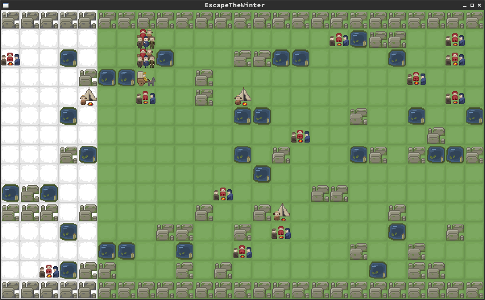

Escape the Winter
=================
A small premature game that [cmdsoniq][] and [danbruegge][] build on the Berlin Mini Game Jam
on 22.11.2014.

Graphics: [cmdsoniq][]  
Code: by [danbruegge][]

The Aim is to escape from the winter that came from the left side. Try to
collect humans on your way. If you have lost to many humans on your way, you will
die. If you have to many humans in your group then the winter will catch you...

The game is not ready yet and some features are missing.

Screenshot
==========

[cmdsoniq]: http://twitter.com/cmdsoniq/  "cmdsoniq"
[danbruegge]: http://twitter.com/danbruegge/ "danbruegge"
